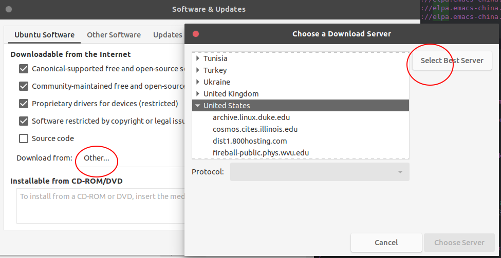

# change-mirror
中国内访问一些开发所用的网站比较慢，更换对应的源，可以提高速度。

## npm 

### 淘宝源
* 使用方法: 下载`cnpm`代替默认的`npm`。其他方法可以参考[链接](https://npm.taobao.org/)内容。
```bash
$ npm install -g cnpm --registry=https://registry.npm.taobao.org
```

## Ubuntu

### 系统自带
* 打开系统程序“软件和更新”\(或Software & Update\), 点击“下载自”对应的下拉列表。然后选择“其他”。弹出的对话框右侧，点击“选择最好的服务器”。程序会自动帮你选择附近速度最快的源。


## spacemacs

### 清华ELPA
* [链接](https://mirrors.tuna.tsinghua.edu.cn/help/elpa/)
* master分支的用户，添加下面的代码到`.spacemacs`的`dotspacemacs/user-init()`
```elisp
(setq configuration-layer--elpa-archives
    '(("melpa-cn" . "http://mirrors.tuna.tsinghua.edu.cn/elpa/melpa/")
      ("org-cn"   . "http://mirrors.tuna.tsinghua.edu.cn/elpa/org/")
      ("gnu-cn"   . "http://mirrors.tuna.tsinghua.edu.cn/elpa/gnu/")))
```
* develop分支的用户使用`configuration-layer-elpa-archives`代替原来的`configuration-layer--elpa-archives`（ -- 换成 - ）
```elisp
(setq configuration-layer-elpa-archives
    '(("melpa-cn" . "http://mirrors.tuna.tsinghua.edu.cn/elpa/melpa/")
      ("org-cn"   . "http://mirrors.tuna.tsinghua.edu.cn/elpa/org/")
      ("gnu-cn"   . "http://mirrors.tuna.tsinghua.edu.cn/elpa/gnu/")))
```

### Emacs China ELPA
* [链接](https://elpa.emacs-china.org/)
* master分支的用户，添加下面的代码到`.spacemacs`的`dotspacemacs/user-init()`
```elisp
(setq configuration-layer--elpa-archives
    '(("melpa-cn" . "http://elpa.emacs-china.org/melpa/")
      ("org-cn"   . "http://elpa.emacs-china.org/org/")
      ("gnu-cn"   . "http://elpa.emacs-china.org/gnu/")))
```
* develop 分支的用户使用`configuration-layer-elpa-archives`代替原来的`configuration-layer--elpa-archives`（ -- 换成 - ）
```elisp
(setq configuration-layer-elpa-archives
    '(("melpa-cn" . "http://elpa.emacs-china.org/melpa/")
      ("org-cn"   . "http://elpa.emacs-china.org/org/")
      ("gnu-cn"   . "http://elpa.emacs-china.org/gnu/")))
```

## Docker

### Docker中国官方镜像加速
* [链接](https://www.docker-cn.com/registry-mirror)
* 可以直接使用以下命令直接从该镜像加速地址进行拉取。
```bash
$ docker pull registry.docker-cn.com/myname/myrepo:mytag
```
* 为了永久性保留修改，您可以修改`/etc/docker/daemon.json`文件并添上`registry-mirrors`键值。
```json
{
  "registry-mirrors": ["https://registry.docker-cn.com"]
}
```

### 阿里云官方镜像加速
* [链接](https://help.aliyun.com/document_detail/60750.html)
* 当您下载安装的Docker Version不低于1.10时，建议直接通过daemon config进行配置。使用配置文件/etc/docker/daemon.json（没有时新建该文件）。
```json
{
    "registry-mirrors": ["<your accelerate address>"]
}
```
* 当您的Docker版本较旧时,只能根据系统的不同修改对应的配置文件了。具体可查看[链接](https://help.aliyun.com/document_detail/60750.html)。
* 对应的加速器地址，需要登陆阿里云控制台后，到[容器镜像服务控制台](https://cr.console.aliyun.com/)查看。

